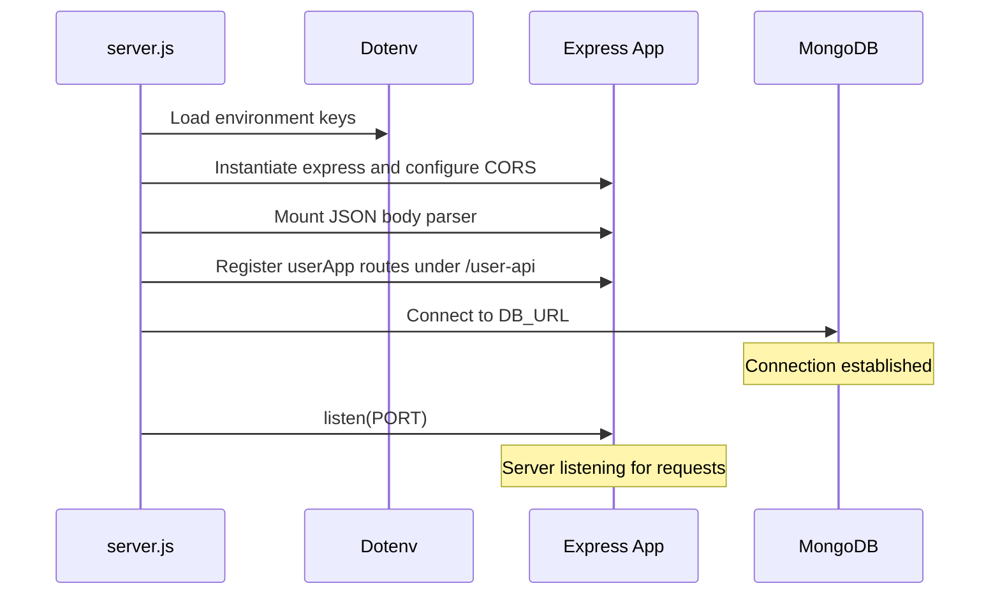

# Backend Server Application

This directory contains the Express.js server application for the User Management system, providing the REST API endpoints and coordinating database access.

## Table of Contents

- [About the Directory](#about-the-directory)
- [Environment Configuration](#environment-configuration)
- [Server Lifecycle and Boot Flow](#server-lifecycle-and-boot-flow)
- [Error Handling System](#error-handling-system)
- [Directory Mapping](#directory-mapping)

## About the Directory

The server is built with Node.js and Express. It connects to a MongoDB database using Mongoose ODM, handles CORS restrictions, and serves user management operations under the `/user-api` routing path.

---

## Environment Configuration

The backend application requires specific environment variables to connect to database ports and handle incoming cross-origin requests.

Create a `.env` file in the root of the `BackEnd/` directory:

| Environment Variable | Required | Default Value | Description |
| :--- | :--- | :--- | :--- |
| `PORT` | Yes | `4000` | Port number on which the Express server listens. |
| `DB_URL` | Yes | None | MongoDB Atlas connection string or local database URL. |
| `FRONTEND_URL` | No | `http://localhost:5173` | The origin URL of the React client allowed by the CORS middleware. |

---

## Server Lifecycle and Boot Flow

The server startup sequence proceeds as follows:

---

## Error Handling System

The server implements a centralized Express error handling middleware in `server.js` to catch database operations issues and return formatted, standardized JSON responses:

- **Validation Errors (`ValidationError`)**: Automatically triggered when request bodies fail Mongoose schemas constraints. Returns `HTTP 400 Bad Request` with validation error lists.
- **Invalid ID Formats (`CastError`)**: Triggered when client route parameters supply malformed MongoDB ObjectIds. Returns `HTTP 400 Bad Request`.
- **Duplicate Constraints (Mongoose Code `11000`)**: Triggered when non-unique values are supplied for columns set as unique (e.g., duplicate emails). Returns `HTTP 409 Conflict`.
- **Internal Server Failures**: Catches unhandled code errors, logs the trace, and returns a general `HTTP 500 Internal Server Error` standard payload.

---

## Directory Mapping

- **[`APIs/`](file:///Users/mdriyaz/.gemini/antigravity/scratch/user_management/BackEnd/APIs)**: Express mini-apps routing directories.
- **[`Models/`](file:///Users/mdriyaz/.gemini/antigravity/scratch/user_management/BackEnd/Models)**: Schema definitions and database validation constraints.
- **[`server.js`](file:///Users/mdriyaz/.gemini/antigravity/scratch/user_management/BackEnd/server.js)**: Central bootstrap entrypoint.
- **[`test.http`](file:///Users/mdriyaz/.gemini/antigravity/scratch/user_management/BackEnd/test.http)**: REST client test collection.
- **`package.json`**: Dependencies and initialization scripts:
  - `npm start`: Launches the server using node native execution.
