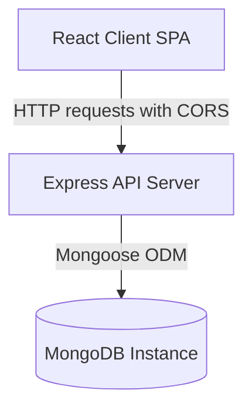

# User Management Application

This repository contains a full-stack User Management Application built using the MERN stack (MongoDB, Express, React, and Node.js). The application supports creating, listing, viewing, and soft-deleting user profiles with validation checking.

## Table of Contents

- [About the Project](#about-the-project)
- [System Architecture](#system-architecture)
- [Technology Stack](#technology-stack)
- [Installation and Setup](#installation-and-setup)
- [Directory Structure](#directory-structure)

---

## About the Project

The User Management Application allows administrators to register users, view user lists, review details, and delete entries. It incorporates soft delete patterns (setting a status flag to inactive instead of database deletion) and provides a clean, responsive layout.

---

## System Architecture

The application is structured into a backend API server and a frontend client Single Page Application:



---

## Technology Stack

### Backend
- **Node.js & Express**: API routing, request parsing, and error-handling middlewares.
- **MongoDB & Mongoose**: Document schema definitions, data constraints, validation errors parsing, and connection pooling.
- **Cors**: Dynamic origin resolution.
- **Dotenv**: Central configuration management.

### Frontend
- **React 19**: Component structure, hooks (`useState`, `useEffect`), and visual states.
- **React Router 7**: Declarative client routing.
- **Vite 7**: Local build server.
- **Tailwind CSS v4**: PostCSS compiling and responsive UI styling.

---

## Installation and Setup

### Prerequisites
- Node.js (version 18.x or higher)
- MongoDB running locally or a MongoDB Atlas connection string

### Step-by-Step Installation

1. **Clone the Repository**:
   ```bash
   git clone https://github.com/Riyaz706/user_management.git
   cd user_management
   ```

2. **Configure the Backend**:
   - Navigate to the `BackEnd/` directory:
     ```bash
     cd BackEnd
     ```
   - Install dependencies:
     ```bash
     npm install
     ```
   - Create a `.env` file containing configuration keys:
     ```env
     PORT=4000
     DB_URL=mongodb://localhost:27017/user_management_db
     FRONTEND_URL=http://localhost:5173
     ```
   - Start the backend server:
     ```bash
     npm start
     ```

3. **Configure the Frontend**:
   - In a separate terminal session, navigate to the `FrontEnd/` directory:
     ```bash
     cd FrontEnd
     ```
   - Install dependencies:
     ```bash
     npm install
     ```
   - Create a `.env` file containing the backend endpoint address:
     ```env
     VITE_API_BASE_URL=http://localhost:4000
     ```
   - Start the client development server:
     ```bash
     npm run dev
     ```

---

## Directory Structure

```
user_management/
├── BackEnd/             # Express API Server
│   ├── APIs/            # Express router routes mapping
│   │   └── userApi.js   # User API endpoints
│   ├── Models/          # Mongoose database models
│   │   └── userModel.js # User schema constraints
│   ├── package.json     # Backend script actions and definitions
│   ├── server.js        # Server execution entrypoint
│   └── test.http        # REST Client request log
└── FrontEnd/            # React + Vite client app
    ├── public/          # Static public assets
    ├── src/             # Frontend source code
    │   ├── Components/  # UI layouts and page files
    │   ├── App.css      # Core component layout styles
    │   ├── App.jsx      # Client routing configurations
    │   ├── index.css    # Global Tailwind styles
    │   └── main.jsx     # DOM bootstrap mount
    ├── package.json     # Frontend script actions and definitions
    └── vite.config.js   # Vite compiler parameters
```
